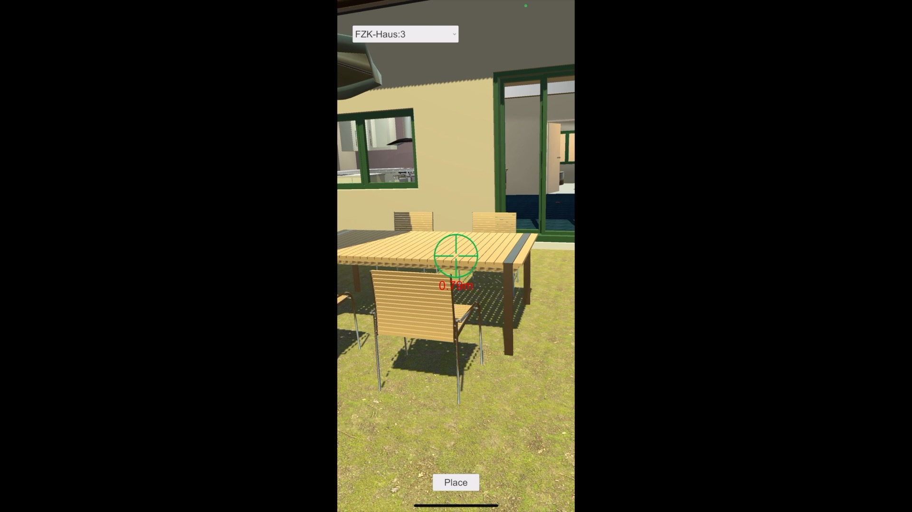
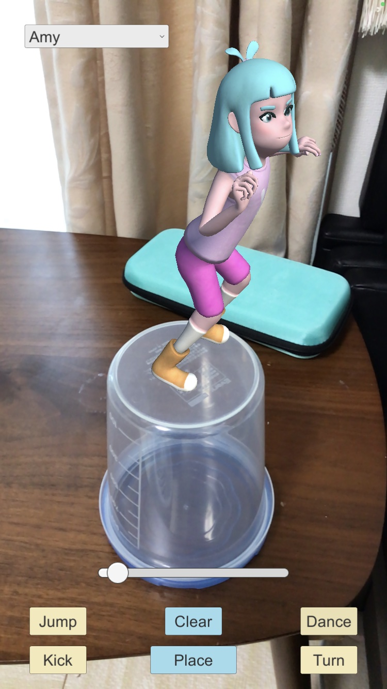

# AR building blocks

(Work in progress)

I have been working on AR apps over the past half year in my spare time. This repo is for sorting out AR building blocks that I have developed in those AR apps.

Requirements:
- Unity
- ARFoundation and ARKit
- iOS (iPhone/iPad)

## Building blocks

### EDM (LiDAR-based)

EDM (Electronic Distance Measurement) in the surveying terminology is useful for AR applications as well.

Last year I saw this AR device "[SiteVision](https://sitevision.trimble.com)" at a trade show in Tokyo. The device is also equipped with Lazer-based EDM.

iPad Pro and iPhone 12 Pro are equipped with LiDAR. I have found that EDM based on the LiDAR is very useful when I am placing an AR anchor on a wall.

=> [code](./unity/EDM)

### EDM (PointCloud-based)

Most of smartphone models in the market are not equipped with LiDAR. We use point cloud for distance measurement instead of LiDAR.

=> [code](./unity/EDM2)

### World origin visualization

This app is just to visualize the origin on the world coordinates.

=> [code](./unity/WorldOrigin)

### QR code reader

This app uses ARCameraBackground for recognizing a QR code with ZXing library.

=> [code](./unity/QRCodeReader)

### Rendering IFC BIM in AR app

This is to explane how IFC-format BIM can be rendered in my original AR app.

I downloaded "FZK Haus" from the following BIM archive:
http://openifcmodel.cs.auckland.ac.nz

Then I modified the original FZK Haus IFC BIM with Blender (with BlenderBIM add-on) for my AR app:
- modified some parts to make them look better
- added CC0Texture to some faces
- added a piano chair
- etc
 

=> [Demo video on YouTube](https://youtu.be/BFTbxZobyvY)

=> [code](./unity/ObjectPlacement)

### Dancing Mixamo characters

This is a typical AR app, but it uses the EDM feature above for placing an object at a specific location.

=> [code](./unity/Dance)

### 3D Scanner and AR

This app visualizes 3D models scanned by this [3D Scanner app](https://apps.apple.com/us/app/3d-scanner-app/id1419913995).

...

## Building blocks not included in this repo.

### Microsoft Spatial Anchors

I tested Spatial Anchors by developing test apps on my own. I found that the technique used in Spatial Anchor is not suitable for most of my AR-related works.

### UWB

Indoor positioning systems based on UWB are still very expensive.
