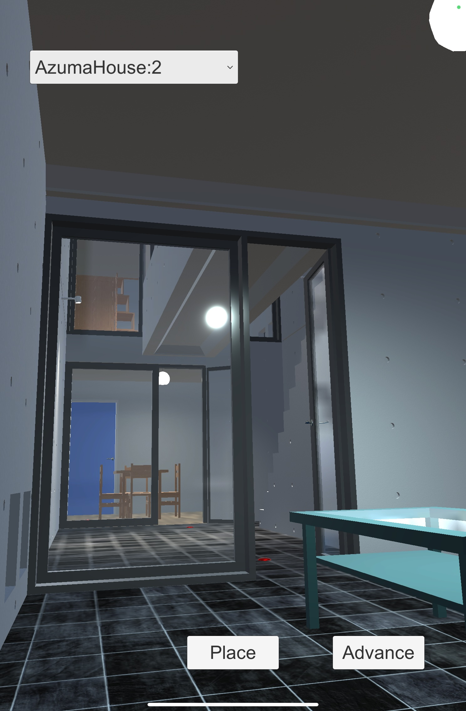
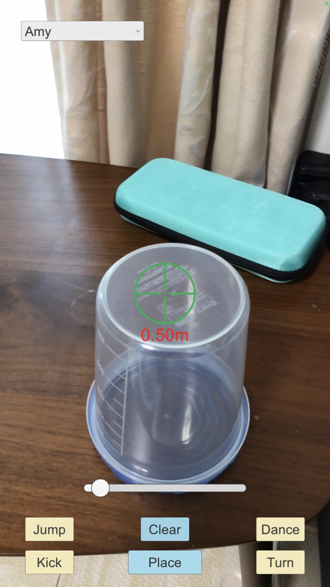
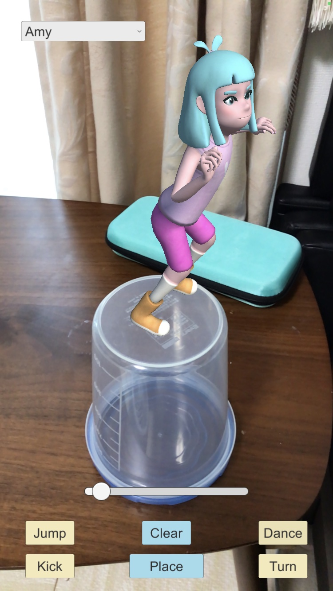
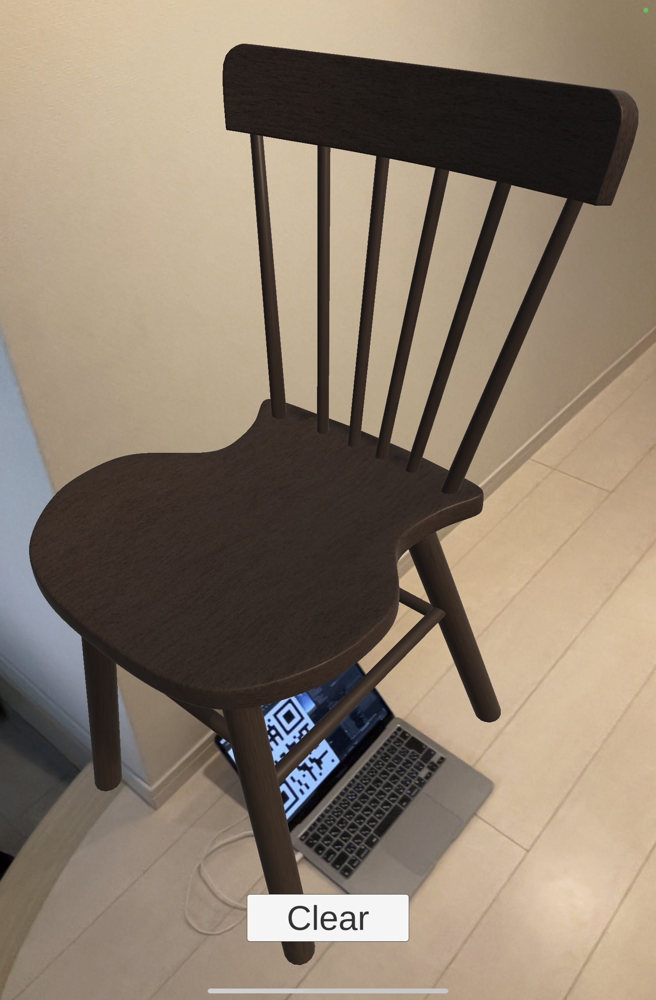
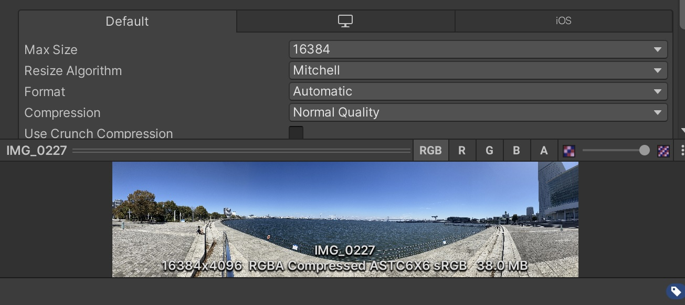
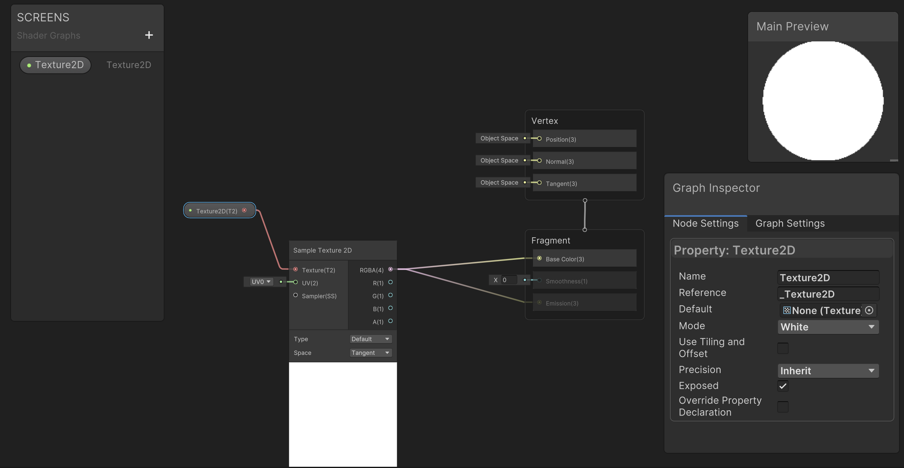
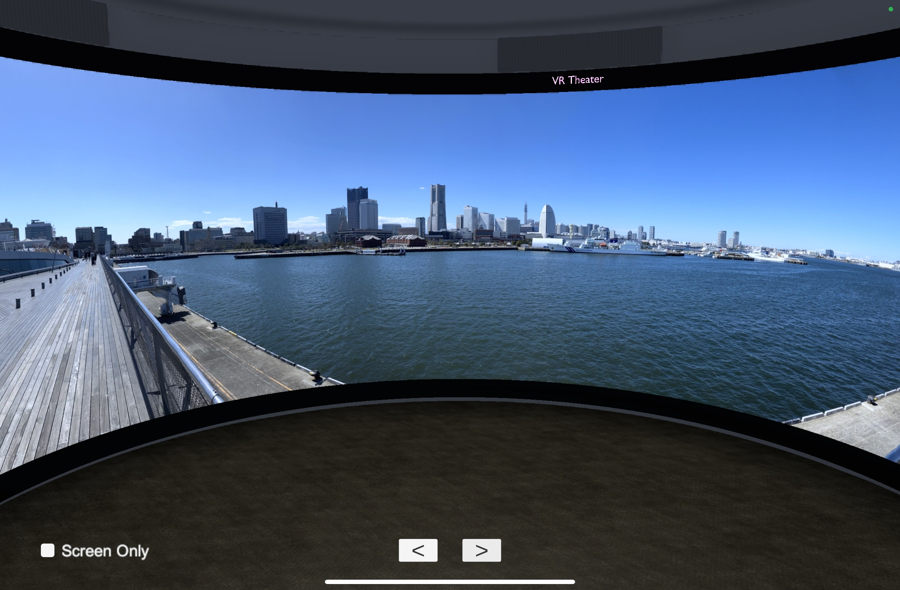
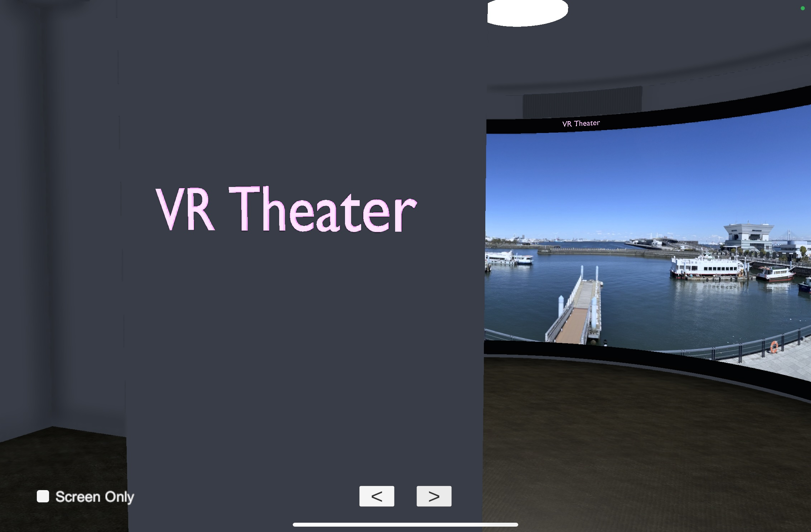
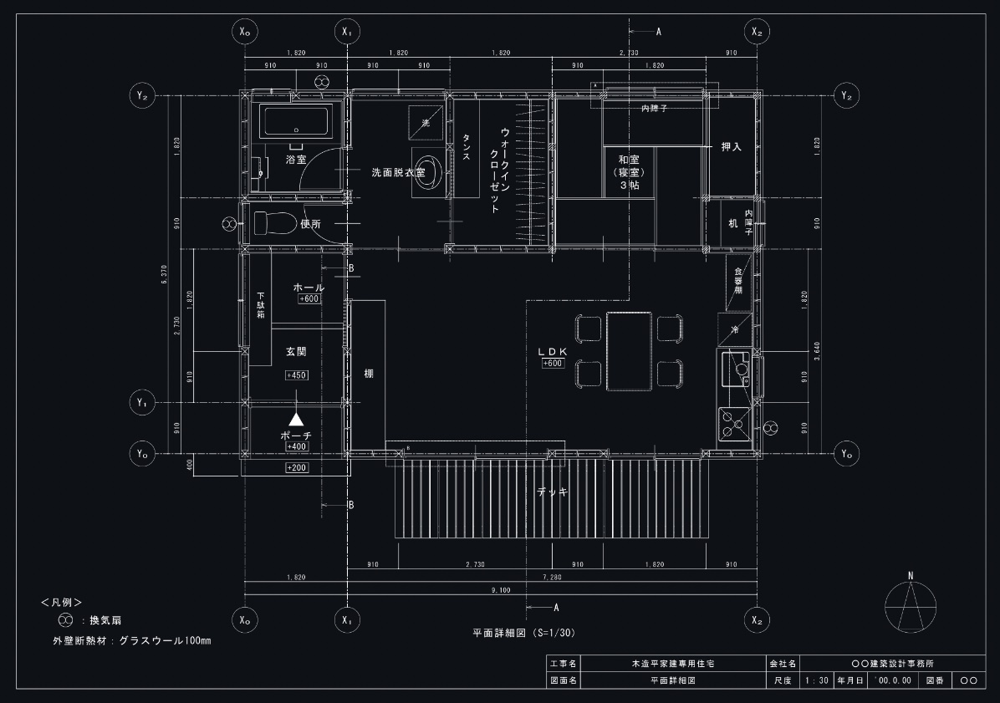

# AR Building Blocks

I have been developing AR applications since 2021. This repository serves as a collection of the AR building blocks I have created during that time.

Requirements:
- Unity
- AR Foundation 6.x (Note: All building blocks are updated to AR Foundation 6.x, except for the EDM (LiDAR-based) module).

## Building blocks

### EDM (LiDAR-based)

Note: This building block requires an iPhone or iPad equipped with a LiDAR scanner. Please note that as I do not currently own a LiDAR-equipped device, this code remains dependent on an older version of AR Foundation.

EDM (Electronic Distance Measurement), a term from surveying, is also highly useful in AR applications.

I recently encountered "[SiteVision](https://sitevision.trimble.com)," an AR device equipped with laser-based EDM, at a trade show in Tokyo.

The iPad Pro and iPhone 12 Pro (and later) feature LiDAR. I've found that LiDAR-based EDM is exceptionally useful for placing AR anchors accurately on walls.


=> [code](./unity/EDM)

### EDM2 (ARPlane/PointCloud-based)

Most of smartphone models in the market are not equipped with LiDAR. We use point cloud for distance measurement instead of LiDAR.

=> [code](./unity/EDM2)

### World origin visualization

This app is just to visualize the origin on the world coordinates.


=> [code](./unity/WorldOrigin)

### QR code reader

This app uses ARCameraBackground for recognizing a QR code with ZXing library.


=> [code](./unity/QRCodeReader)

### Rendering IFC BIM in AR app (URP)

This is to explane how IFC-format BIM can be rendered in my original AR app.

I downloaded "FZK Haus" and "Azuma House" from the following BIM archive:
http://openifcmodel.cs.auckland.ac.nz

Then I modified the original BIM with Blender (with BlenderBIM add-on) for my AR app:
- modified some parts to make them look better
- added CC0Texture to some faces
- added a piano chair
- etc
 


=> [Demo video on YouTube](https://youtu.be/BFTbxZobyvY)

=> [code](./unity/ObjectPlacement)

### Dancing Mixamo characters

This project demonstrates a standard AR application that leverages the EDM feature mentioned above to place characters at specific locations.
A standard AR application that leverages the EDM functionality to accurately place animated characters at specific real-world locations.





=> [code](./unity/Dance)

### Multiple AR markers (URP)

This application supports the tracking of multiple AR markers simultaneously.



=> [code](./unity/ARMarkers)

### VR Theater (URP)

This application displays 240-degree 16K panoramic photos captured with the iPhone SE Camera app. The iPad mini is particularly well-suited for viewing these high-resolution panoramas. To use your own photos, save them in the `Resources/Panorama` folder and configure the settings as shown below.



I developed the following Shader Graph to map panoramic textures (Texture2D) onto a 240-degree virtual screen.



Screenshots of the application running on an iPad mini:





=> [code](./unity/VRTheater)

Note: I disabled the "Auto Focus" option in the AR Camera Manager to improve tracking stability.

### Converting PDF into transparent PNG inverting black and white

This Python 3 script converts PDF documents into transparent PNG images suitable for AR applications:

```
$ PDF_converter_for_AR.py -i floorplan_sample.pdf
```



## Note

### Blackscreen problem on URP with Android.

If you don't specifically need Vulkan's performance benefits, the simplest path for your Android smartphone is to remove Vulkan from the Graphics APIs list and use OpenGLES3. This avoids the need for the Command Buffer feature and is generally more "battle-tested" for AR projects.
